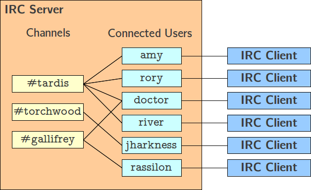

<h1 align="center">
	🌐 FT_IRC 🌐
</h1>

## Description

The "ft_irc" project involves creating a robust IRC server using C++, named "ircserv." This server enables real-time text-based communication over the Internet, supporting multiple clients concurrently with non-blocking I/O operations. The project emphasizes adherence to standards, robust error handling, and clean code practices.

## Relevance

This project showcases proficiency in C++, network programming, and system-level operations. Developing a functional IRC server demonstrates the ability to work with complex systems, handle multiple connections efficiently, and implement secure communication protocols. These skills are directly applicable in roles requiring backend development, network engineering, and protocol implementation.

## Skills Involved

- C++
- Network Programming
- Non-blocking I/O
- Error Handling
- Clean Code Practices

## Features

- Multi-client support
- Non-blocking I/O operations
- User authentication and nickname setting
- Channel operations (join, private messaging)
- Operator functionalities (KICK, INVITE, TOPIC, MODE)
- Bonus features: File transfer and a bot (that let's you know the available commands and that moderates messages inside the channels)

## Resources to Study

- C++ Documentation : [C++ Reference](https://en.cppreference.com/w/) | [Learn C++](https://www.learncpp.com)
- Network Programming Resources : [socket programing]([https://www.rfc-editor.org/rfc/rfc1459](https://www.geeksforgeeks.org/socket-programming-cc/))
- IRC Protocol Specifications : [rfc1459](https://www.rfc-editor.org/rfc/rfc1459), [IRC Modern Protocol](https://modern.ircdocs.horse), 

## Reference Client

HexChat is the reference IRC client used for this project.

## How to Run

1. Clone the repository: `git clone [repository_url]`
2. Navigate to the project directory: `cd ft_irc`
3. Compile the source files using the provided Makefile: `make`
4. Run the IRC server with the specified port and password: `./ircserv <port> <password>`
5. Connect to the IRC server using HexChat:
    - Open HexChat and enter your desired nickname and other details.
    - Connect to the server using the server address and port specified earlier.
    - Enter the provided password when prompted.

6. Connect to the IRC server using `nc`:
    - Open a terminal window.
    - Use the following command to connect: `nc 127.0.0.1 <port>`

## Conclusion

The "ft_irc" project demonstrates proficiency in C++ and networking, showcasing the ability to build a reliable IRC server with essential features. It serves as a tangible example of practical skills relevant to roles involving backend development, network engineering, and system-level programming.

## License

[MIT License](LICENSE)

## Subject Details

[Project Subject Details](en.subject.pdf)

## Authors

- André Francisco Baião Rolão Cândido da Silva
- Gabriel Norberto Correia Guerra Franco
- João Paulo Rodrigues Pereira

